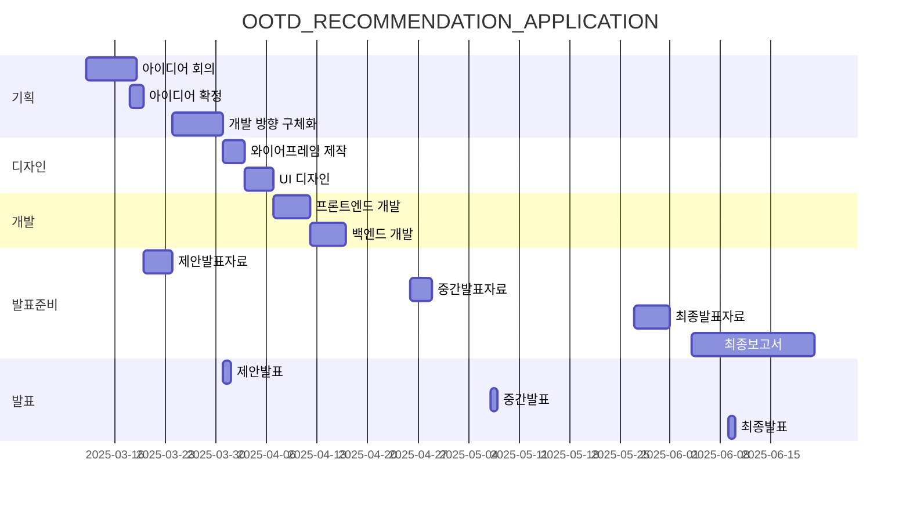

```mermaid
gantt
    title OOTD_RECOMMENDATION_APPLICATION

    dateFormat  YYYY-MM-DD

    section 기획
    아이디어 회의      :a1, 2025-03-12, 7d
    아이디어 확정      :a2, 2025-03-18, 2d
    개발 방향 구체화    :a3, after d1, 7d

    section 디자인
    와이어프레임 제작   :b1, after a3, 3d
    UI 디자인           :b2, after b1, 4d
    
    section 개발
    프론트엔드 개발     :c1, after b2, 5d
    백엔드 개발         :c2, after c1, 5d

    section 발표준비
    제안발표자료        :d1,    after a2,      4d
    중간발표자료        :d2,    2025-04-26,    3d
    최종발표자료        :d3,    2025-05-27,    5d
    최종보고서          :d4,    2025-06-04,    17d

    section 발표
    제안발표            :e1,    2025-03-31,    1d 
    중간발표            :e2,    2025-05-07,    1d
    최종발표            :e3,    2025-06-09,    1d

```
